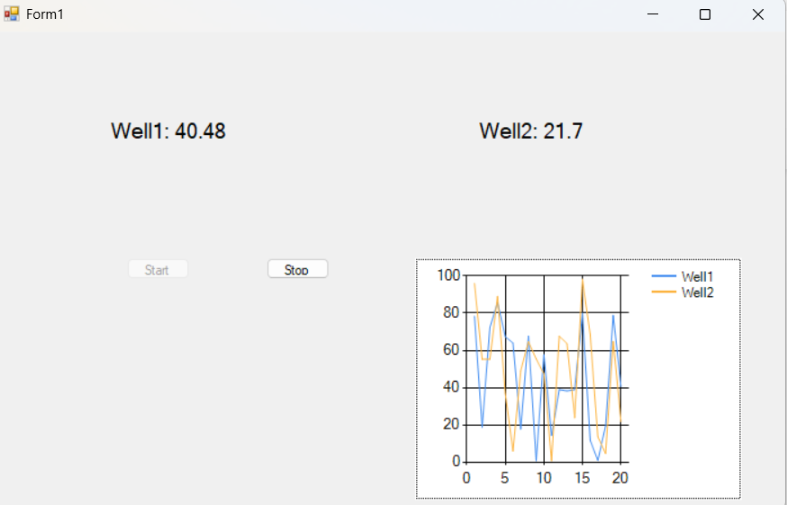
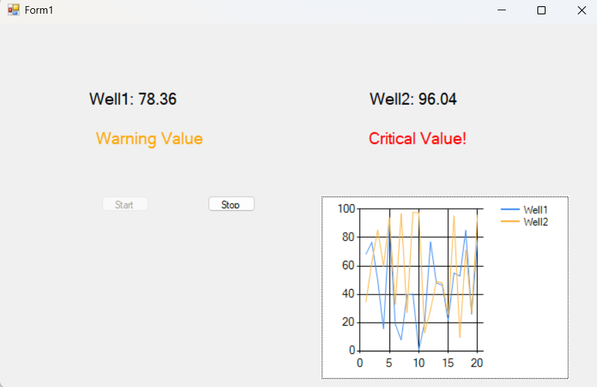

# Mini SCADA Dashboard



## Overview
This is a **Mini SCADA/HMI Dashboard** built using **VB.NET Windows Forms** and **PostgreSQL**.  
It simulates real-time sensor readings for a well site, displays them in a live chart, and raises alerts for threshold breaches.  
The project is designed as a **portfolio demonstration** for Industrial Automation/SCADA-related roles.

---

## Features
- Simulates sensor readings for multiple well sites.
- Real-time display of sensor values.
- Multi-threshold alert system for high values.
- Live chart plotting using Windows Forms Chart control.
- Stores sensor readings in **PostgreSQL** database.
- Start/Stop control for simulation.
- Password-free connection via **environment variable** for security.

---

## Tech Stack
- **Frontend/GUI:** VB.NET WinForms  
- **Database:** PostgreSQL  
- **Packages:** Npgsql for PostgreSQL connectivity  
- **Version Control:** Git & GitHub  

---

## Setup Instructions

1. **Clone the repo:**
    
    ```bash
    git clone https://github.com/Niru6241/mini-scada-dashboard.git
    cd mini-scada-dashboard
    ```

2. **Set PostgreSQL password as environment variable (Windows):**
    
    - Press **Win + S**, type `Environment Variables`, select **Edit the system environment variables**  
    - Click **Environment Variables…**  
    - Under **User variables**, click **New…**  
      - Name: `PGPASSWORD`  
      - Value: your Postgres password  
    - Click **OK → OK → OK**  
    - Restart Visual Studio  

3. **Update connection string in `Form1.vb`** (if needed):
    
    ```vb.net
    Dim dbPassword As String = Environment.GetEnvironmentVariable("PGPASSWORD")
    Dim connStr As String = $"Host=localhost;Port=5432;Username=postgres;Password={dbPassword};Database=wellsite_db"
    ```

4. **Open the solution in Visual Studio:**  
    - `WellSiteDashboard.sln`

5. **Build and run:**  
    - Click **Start** to simulate sensor readings.

---

## Screenshots

### Main Dashboard with Live Chart


### High Value Alert / Warning Values


---

## License
This project is licensed under the **MIT License**. See [LICENSE](LICENSE) for details.
